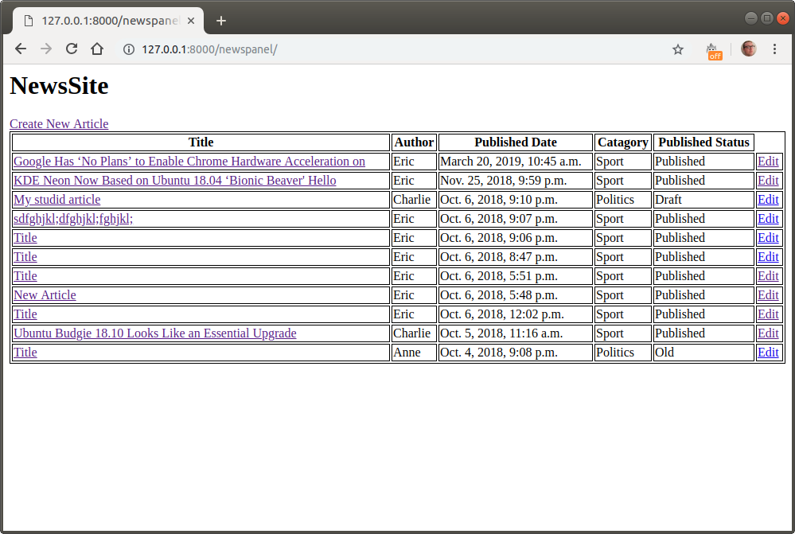
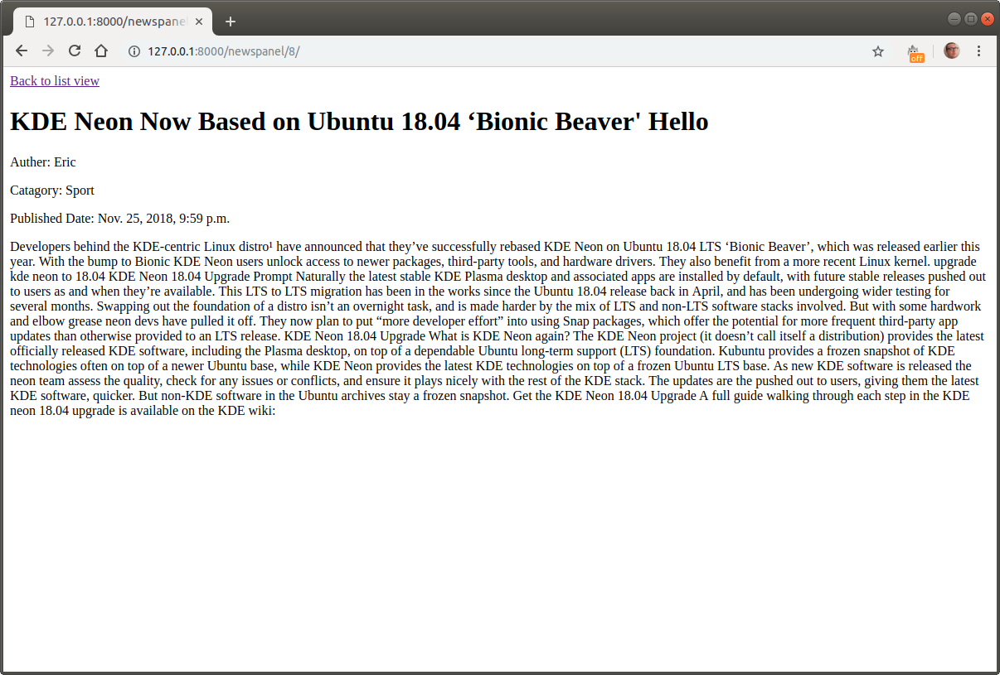
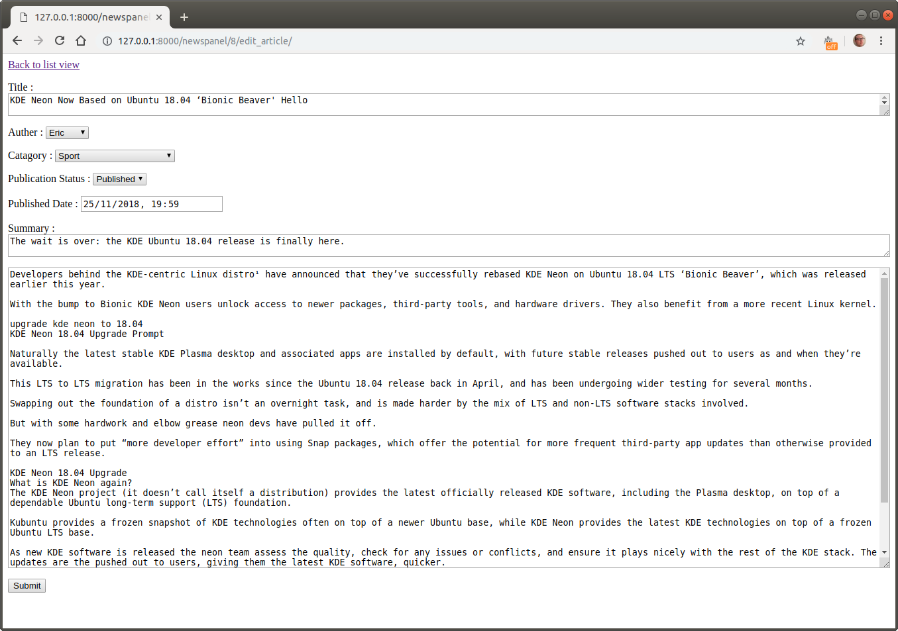
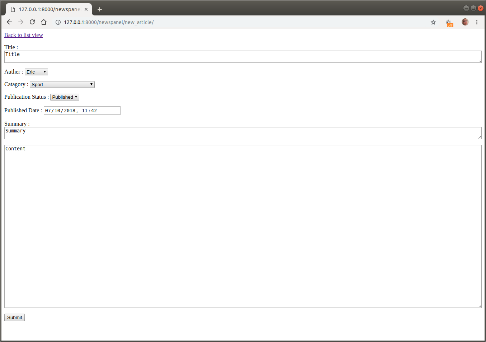
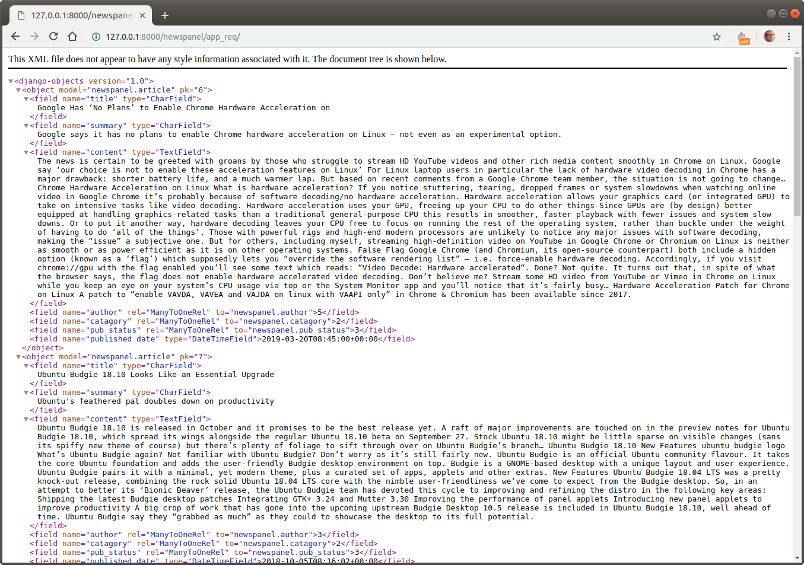

# NewsPanel

Welcome to NewsPanel. NewsPanel is a simple demo web app. Once you have NewsPanel up and running you can create view and edit articles. NewsPanel can also receive a request and return an xml file to populate a potential future mobile/standalone application. In the  future, users will be able to log in and use the website to both read, upload, edit and approve content depending on their access rights. This application will only need to be installed in one location on a server and all other users will then access remotely. NewsPanel has been tested on Ubuntu, Mac osx, and Windows 10 and in several browsers.

### Prerequisites

NewsPanel has a few prerequisites:

- **Python 3**: NewsPanel is written in Python. Ensure you have an up to date installation of **Python 3** on your machine:
  - For Linux (recommended) check your package manager. 
  - For Windows [here](https://www.python.org/downloads/windows/).
  - For Mac os [here ](https://www.python.org/downloads/mac-osx/) (mac install in official python docs) or [here](https://docs.python-guide.org/starting/install3/osx/) (using homebrew).
- **Pip 3** : Pip 3 is used to install Python 3 modules. If you have installed Python 3 then a version of pip3 should be packaged along with it. If you do not then consult [here](https://pip.pypa.io/en/stable/installing/)
- **Django** : Django is a Python framework for developing web applications. With Pip3 it should be as simple as entering `pip3 install Django` on mac and linux or `py -m pip install Django` on windows. Find further details of how to install Django [here](https://docs.djangoproject.com/en/2.1/topics/install/#installing-official-release).
- **SQLite3** : SQLite3 is a basic database engine. Luckily it coms packaged in Python by default. In case of any issues however look [here](https://www.sqlite.org/docs.html) (official docs) or [here](https://www.tutorialspoint.com/sqlite/sqlite_installation.htm) (more readable tutorial).

### Installation

Once all of the above is in place, it is time to get going with NewsPanel. If you are reading this you have likely already downloaded the source code from the [git hub page](https://github.com/bossstein/newspanel) and unzipped the file in you desired location. Below I have given commands in a format suitable for Mac, Linux and Unix systems. After much searching I found that replacing `python3` with just `py` allows you to run python scripts from the command prompt. For more information about running python scripts on Windows see [here](https://docs.python.org/3.3/using/windows.html). 

Open a command prompt/terminal in the directory location. Run the following commands to ensure that the object model is properly installed:

```
python3 manage.py makemigrations
python3 manage.py migrate
```

After this you can now start the inbuilt web server to start the application:

```
python3 manage.py runserver
```

After running this command, you will expect to see something like the following:

```
Performing system checks...

System check identified no issues (0 silenced).
October 07, 2018 - 11:30:34
Django version 2.1.2, using settings 'AdminPanel.settings'
Starting development server at http://127.0.0.1:8000/
Quit the server with CONTROL-C.
```

### Using the app

To access the web app open a browser window and enter the following into your address bar:

```
http://127.0.0.1:8000/newspanel/
```

You should now expect to see a list view of test articles from where you can read, edit or create articles:



From here you may read any article by clicking on its title. It will look like this:



From the original list screen select the edit button on an article to edit attributes for that article:



From here you can click "submit" to save these changes. Again from the original list screen select "Create New Article". This brings you back to the same screen as for edit but filled with default values for a new article.



Finally. If an application needs to be populated with articles from NewsPanel it can make a http get request to.

```http://127.0.0.1:8000/newspanel/app_req/```

As seen below in a Chrome browser, this request returns an XML message containing a list of all of the articles and their attributes. An application may then be built that displays these articles, possibly filtering by category, publication date or publication status. 



### Developer Notes

Accessing [http://127.0.0.1:8000/admin/](http://127.0.0.1:8000/admin/) gives access to the admin page.
 
```
user: admin
password: adminadmin
```
 
Here new authors, categories and publication statuses can be added.

The main directory should have the following structure:

```
*.png : Example screenshots.

db.sqlite3 : SQLite3 database. This is autopopulated by django according to models.py.

SQL_Script_Depracated : Currently unused SQL script for potential port to mysql.

AdminPanel : Contains Django code.

newspanel : Most of NewsPanel code.
--migration : changes to object model ready to be implemented.
--templates : html/django style templates for web pages.
--__init__.py
--admin.py : Dictates functionality of admin access to web app. 
--apps.py : Defines apps.
--models.py : Object Model
--tests.py : Tests
--urls.py : Urls for accessing views.
--util.py : Global functions
--views.py : Views.
```

**Further things to develop**:

- Better error handling.
- Add data validation and verification.
- Create user login page.
- Define user groups (admin, editor, writer, reader with account, casual reader).
- Differentiate the functionality and access for different users.
- Extend functionality of publication status to create a journalistic workflow.
- Parse XML into RSS standard for easier app development.
- Create web server and host online.
- Better global labelling in code for future internationalisation.
- Prettier interface.